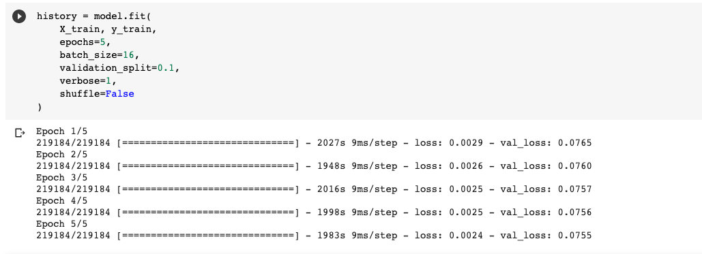
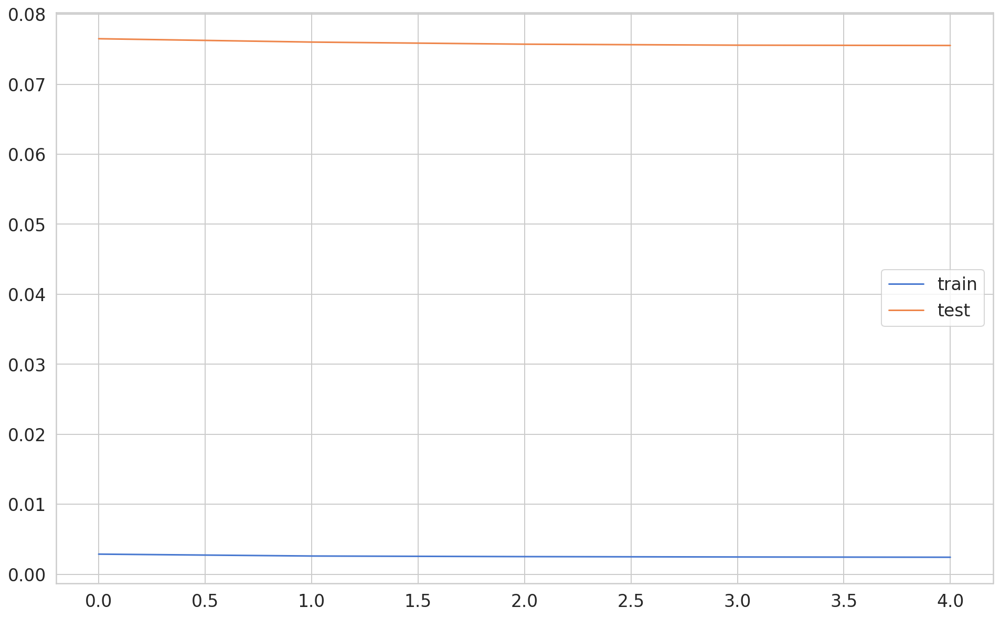
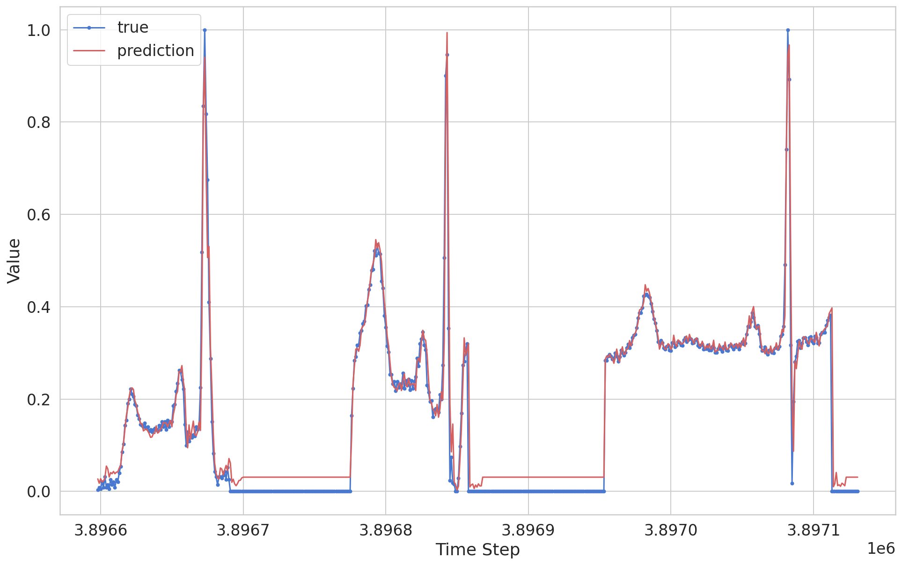
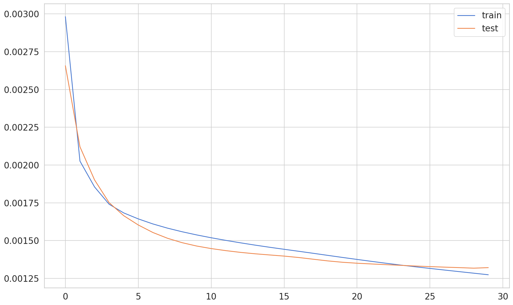
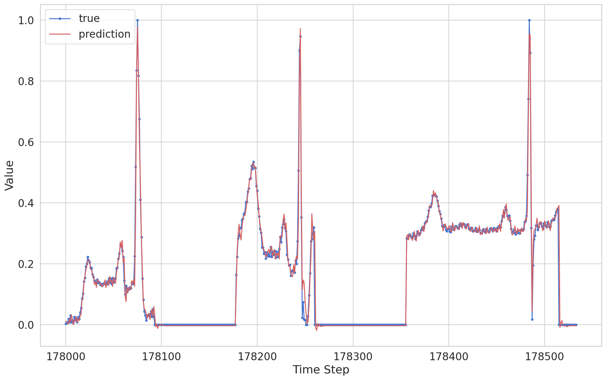
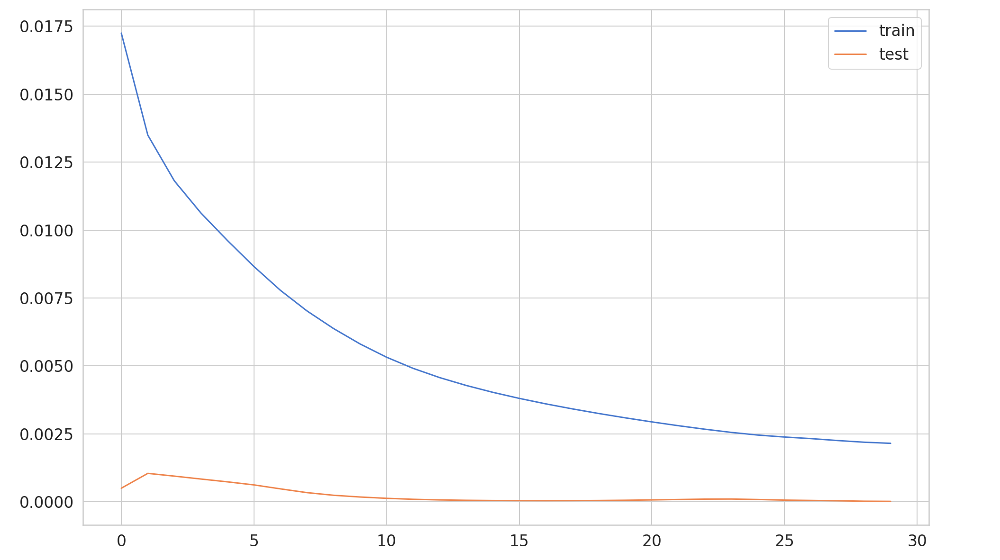
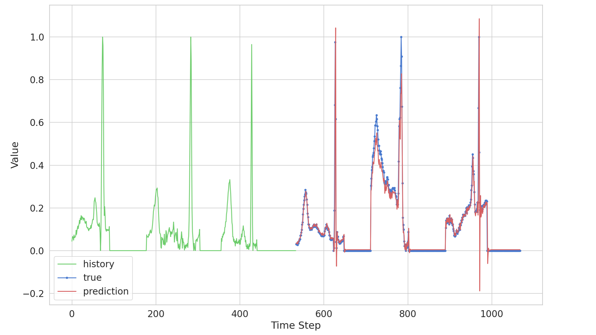

# ECG Prediction - Proof of Concept

This project was see if I am able to predict ECG data using an LSTM. This is still a work on progress, as there still a lot of improvements that need to be done. 

## Version 3 (Nodebook3) - Training With 21891 data points

### Training

### Prediction

model is saved under models/model3 - took 2.5 hours to train

## Version 2 (Notebook2) - Training With 1000 data points

### Training

### Prediction 

## Version 1 (Notebook)

### Training

### Prediction

## Resources that I used: 

https://curiousily.com/posts/time-series-forecasting-with-lstms-using-tensorflow-2-and-keras-in-python

https://www.kaggle.com/shayanfazeli/heartbeat

https://www.kaggle.com/gregoiredc/arrhythmia-on-ecg-classification-using-cnn

